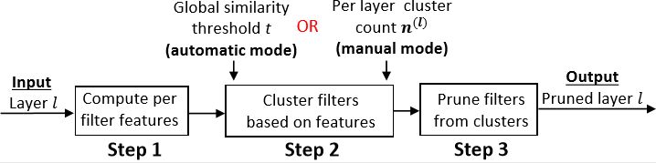

## CUP: Cluster Pruning for Compressing Deep Neural Networks

This repository contains the code for our paper ([arxiv]()).

The method is explained via the following figure.





CUP offers the following major advantages
1. It affords non uniform layerwise pruning.

   a. This allows CUP to achieve state of the art FLOPS reduction.
   
   b. Pruning amount is controlled using only one hyperparamter - t.
   
2. Training time reduction

   a. By linearly varying t during training time, CUP-SS can gradually reduce a models capacity. The final model thus obtained doesn't require any retraining.
   
   b. This leads to large saving in training time.

### Contents
1. [Requirements](#requirements)
2. [Demo](#demo)
3. [Results](#results)
4. [Citation](#citation)
5. [License](#license)

## Requirements
To run this code, we suggest setting up a new anaconda environment as follows.
1. Install [Anaconda](https://www.anaconda.com/download/#linux) (for python ver 3.6 ) 
2. Create new anaconda environment with
   ```conda create -n cup pip```
3. Activate environment
   ```conda activate cup```
4. Install requirements
   ```pip install -r requirements.txt```


## Demo

To reproduce results, you can either 
   - download pre-trained models from [here](https://www.dropbox.com/sh/3jtt4bm4tqroa74/AACMR9Y3i8nZR91msxhKmLcga?dl=0) and place them inside the ```checkpoints``` folder
   - or train (and prune) the models from scratch

To reproduce any experiment, perform the following steps

1. Navigate to the project root and start an ipython server with ```jupyter notebook```.
2. Open any notebook and download the pretrained models mentioned in the first cell.
3. Save the pretrained models in the ```checkpoints/``` dir.
4. Execute each notebook cell in sequence.

NOTES
a. For MNIST and CIFAR-10 experiments, the dataset will be downloaded automatically.
b. For Imagenet, you need to download the dataset and follow the instructions [here](https://github.com/facebookarchive/fb.resnet.torch/blob/master/INSTALL.md#download-the-imagenet-dataset)
   

## Results

Below is the summary of results. For detailed benchmark with respect to other methods, please refer to section 4 and appendix D of the paper

1. Pruning Resnet-50 trained on Imagenet using CUP.

   - We vary only the global hyperparameter t to get following results

                    Resnet-50 on Imagenet 
               |   t   |   FR  | Top-1 | Top-5 |
               |:-----:|:-----:|:-----:|:-----:|
               |  Base |   1x  | 75.86 | 92.87 |
               |  0.65 | 2.18x | 75.07 | 92.30 |
               | 0.675 | 2.32x | 74.73 | 92.14 |
               |  0.70 | 2.47x | 74.60 | 92.06 |
               | 0.725 | 2.64x | 74.42 | 91.74 |

2. Pruning Resnet-50 trained on Imagenet using CUP-SS

   - In this setting, no retraining is allowed. Pruning is performed in the initial training phase.
   - Unit of training time is GPU hours on 3x Titan Xp's with 12 GB RAM each.
   
                       Resnet-50 on Imagenet
         |    k/b   |  FR  | Top-1 | Top-5 | Training Time |
         |:--------:|:----:|:-----:|:-----:|:-------------:|
         |   Base   |  1x  | 75.86 | 92.87 |      66.0     |
         | 0.03/0.3 | 2.20 | 74.40 | 91.99 |     54.48     |
   
## Citation
To be updated

## License
To be updated
